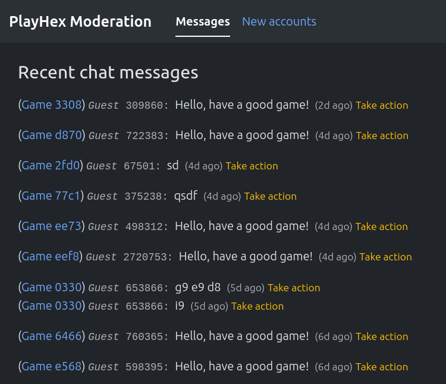
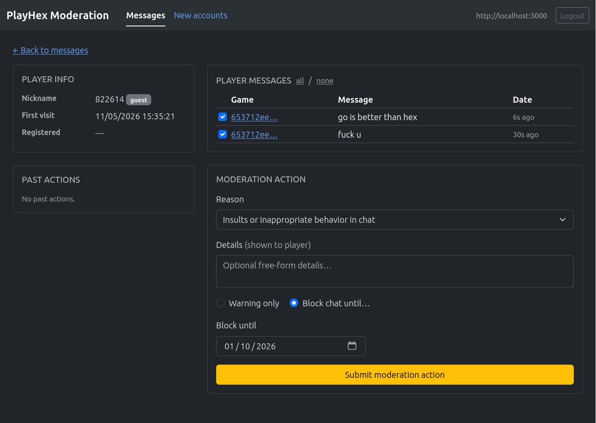
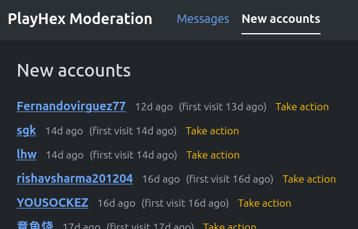

# PlayHex moderation

List last chat messages and nicknames, take moderation action to moderate a chat message and/or block player chat.

## Install

- Serve `index.html` with a local server (e.g by doing `python3 -m http.server 3001`, then go to `http://localhost:3001`)
- In your playhex `.env`, allow cors by adding moderation app url, and add a moderator password (admin password works too):

```
CORS_ALLOWED_ORIGINS=http://localhost:3001
MODERATOR_PASSWORD=myPassword
```

Now you can moderate your PlayHex instance, logins are:

- **API base Url**: your PlayHex instance (e.g `http://localhost:3001`)
- **Moderator API key**: your moderator password from .env (e.g `myPassword`)

## Screenshots

All last chat messages from any are listed, so moderators can easily review all new messages at once:



If a message needs moderation action, moderator can display a warning to the player with the moderation reason,
and also block player chat for a period. Past warning and chat blocks are also displayed to the moderator.



Last nicknames are also listed.


